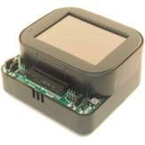
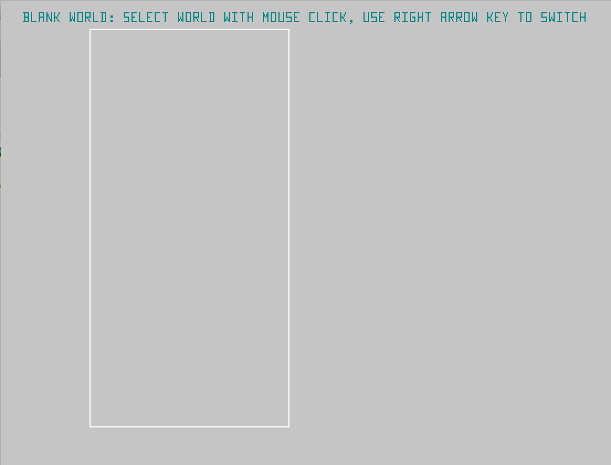
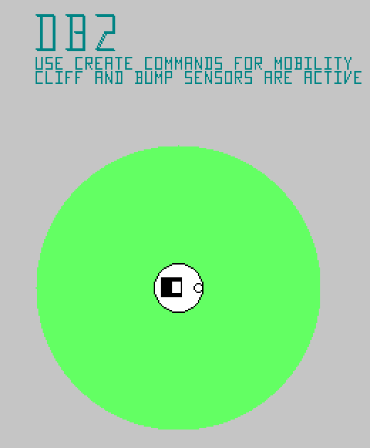
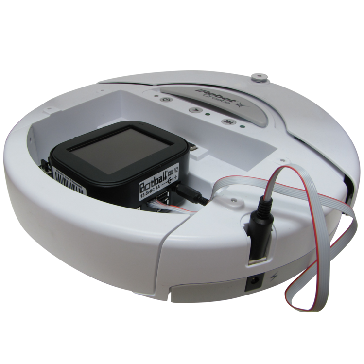
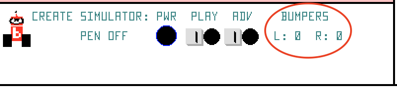
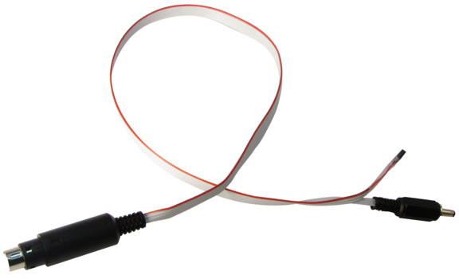
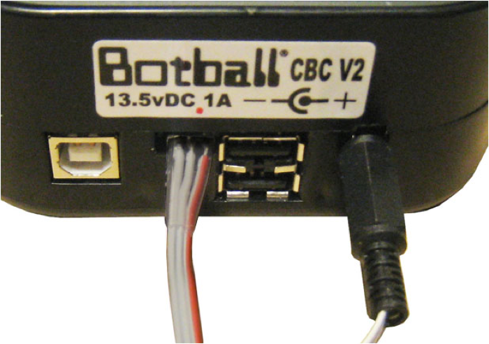

*Version 2017-Fall-1.0, Revised 26 August 2017*
### *CS-472 01 &mdash; Fall 2017*

# Lab 1

## Objective

The objective of today’s lab is to form your group and begin to familiarize yourself with the *KISS* software environment, the CBC controller, and the Create robot base.

## Don’t Forget to Make Entries in Your Engineering Notebook!
I have included prompt questions to give you ideas for what you should write about, but you can write about anything else you think is important.

## Team Selection

Form a team of three. (If the size of the class is not an even multiple of 3, the instructor will give additional instructions.)

* You will be working with these people through the end of October (at least).
* Make sure that at least one team member feels comfortable in the C programming language.
* Exchange contact information - at least email addresses. You can also create your own team channel on Slack.
* Let the instructor know who is in your team. You will be assigned a team number, robot kit, and storage area.

## Software Installation

You will need to install *KIPR’s Instructional Software System* (*KISS*) v3.0.2. There is a link to the installer files available in the *Software* area of the course site.

## Try KISS in Simulation

Try running the following program in the simulator in *KISS*.

1. Start KISS

2. Choose *New File*

3. In the *Templates* window, chose *CBC 2*, and *C* 
    * The *CBC 2* target represents the CBC robot controller. Programs written for the simulator will also work on the CBC harware.  


4. In the Port Selection window, choose Cancel

5. Delete the lines for the “Hello World” program and enter the following program:
   
    ```c
    int main() {
	    kissSimPause(); // wait for space bar
        create_connect(); // establish communication between CBC and Create
        create_drive_straight(150); // speed = 150 mm/s
        sleep(10); // 10 seconds
        create_stop(); // stops motors
        create_disconnect(); // shuts off motors and ends communication
        kissSimPause();
        return 0;
    }
    ```
    
6. Click the Compile button to check for syntax errors.

7. Click the Simulate button to start the simulator.

8. Hit the Space Bar to clear the instructions screen.

9. Use the Right Arrow key, and click to select the *Blank World*. 

10. Select the *DB2* robot. 
    * The DB2 robot represents the CBC on a Create base.  

11. Click to place the robot in the middle of the board.

12. Hit the Space Bar to clear the instructions screen.

13. Hit the Space Bar to unpause the simulator. (The pink background shows that the simulator is paused.)
    * Note: As the robot approaches the wall (white line) watch the Bumper sensors just below the board display. The robot will not stop because it hits the wall, but you can see that the left and right bumpers did detect that it hit something. The robot stopped moving because the 10 seconds was up. 

14.  Hit the Space Bar again to unpause the simulator.

15. Hit the Space Bar again to close the simulator window.

### Engineering Notebook 
Describe the process of getting the simulator running and trying out your first program. Did you have any problems? How did you fix them?

## Try Your Program on the Create

Now you can run your program on the Create robot.

1.  Get your Create, CBC, USB cable, and Create-CBC cable. 

2.  Connect the Create and CBC. The red wire on the CBC end goes toward the USB ports. There is a red dot above that pin. 

3.  Turn on the Create and the CBC.

4.  From the *Target* menu, choose *Choose Port*.

5.  Note the ports available.

6.  Plug the USB cable into the CBC and your computer.

7.  Click the *Refresh* button and choose the new port.

8.  Click the *Download* button.

9.  When the download finishes compiling (watch the CBC screen), disconnect the USB cable from the CBC.
    * When you download a program to the CBC it is automatically compiled and made ready to run
    * Your program name appears in the Run button
    * Pressing Run causes the specified program to run
    * Your program code is retained in the code folder that appears on the initial File Manager screen accessed via the Programs tab on the initial screen

10. Put the Create on the floor.
    * Make sure the power is on.

11. Press the *Run* button on the CBC screen to run the program.
    * Note: The CBC will ignore all simulator commands.

### Engineering Notebook
Describe the process of connecting the robot and controller and running your first program on the robot. Did you have any problems? How did you fix them?

## KISS Reference Material

There is help built into KISS. From the *Help* menu, choose *Manual* to
open the *KISS-C Programmer’s Manual for the CBC Botball Controller*.
You will find information on the KISS environment, a brief overview of
the C programming language, all of the KISS-specific functions for
accessing features of the CBC, details about the sensors and how to use
them, functions for controlling the Create, and the color vision system.

## Measuring Distance Traveled

Modify your program to determine how far your robot traveled before it
stopped and print the distance. You will need to use the following new
functions:

```c
get_create_distance(float lag) 
// A function to return the distance traveled in mm since the Create was
// turned on, or the distance was set. 
// The parameter lag specifies how long to wait between sensor updates 
// in seconds. 
// A lag value of 0.1 is reasonable, except a low motor speeds which will
// produce poor accuracy.
```
    
```c
set_create_distance(int dist)
// Set the distance value.
```

```c
printf()
// The standard ANSI C printf, will print in the simulator or on the 
// LCD screen or the CBC
```

You may want to try it in the simulator before you try it on your robot.

### Engineering Notebook
Describe the process of modifying your program for
this problem. Was writing a robot program different from writing the
kinds of programs you usually write? Did you have any problems? How did
you fix them? Include your code in your notebook.

## Write a Program to Travel a Specific Distance

Write a new program that causes your robot to travel specific distance
and then stop, rather than a specified amount of time. You do not need
any new functions or variables, but you will need a loop. You may want
to try it in the simulator before you try it on your robot.

### Engineering Notebook
Describe the process of writing your program for
this problem. Was writing a robot program different from writing the
kinds of programs you usually write? Did you have any problems? How did
you fix them? Include your code in your notebook.

## Write a Program to Stop When it Hits Something

Write a new program that causes your robot to drive forward until it
hits something with its left or right bumper. It should then stop. You
will need to use the following new functions:

```c
create_drive_straight(int speed)
// Sets both motors to run at speed (in mm/sec).
// Positive is forward, negative is backward
```

```c
get_create_lbump(float lag)
// Indicates whether the left bumper has been hit.
// 0 is not hit, 1 is hit
```

```c
get_create_rbump(float lag)
// Indicates whether the right bumper has been hit.
// 0 is not hit, 1 is hit
```

You may want to try it in the simulator before you try it on your robot.

### Engineering Notebook
Describe the process of writing your program for
this problem. Was writing a robot program different from writing the
kinds of programs you usually write? Did you have any problems? How did
you fix them? Include your code in your notebook.

## Write a Program to Wander

Write a new program that causes your robot to wander around the room.
The robot should drive straight until it bumps into something with its
left or right bumper. If it hits its left bumper, have it backup some
distance and turn right, and then continue. Have it do the opposite for
the right bumper. You can make the robot spin in place with the
following commands:

```c
create_spin_CW(int speed)
// Spins the create clockwise at speed
```

```c
create_spin_CCW(int speed)
// Spins the create counter-clockwise at speed
```

You may want to try it in the simulator before you try it on your robot.

### Engineering Notebook
Describe the process of writing your program for
this problem. How is this program different from the previous program?
Did you have any problems? How did you fix them? Include your code in
your notebook.

## Copyright and License
#### &copy; 2017 Karl R. Wurst, Worcester State University

This work is licensed under the Creative Commons Attribution-ShareAlike 4.0 International License. To view a copy of this license, visit [http://creativecommons.org/licenses/by-sa/4.0/](http://creativecommons.org/licenses/by-sa/4.0/) or send a letter to Creative Commons, 444 Castro Street, Suite 900, Mountain View, California, 94041, USA.